  

 

### Recently active

<!--RECENT-REPOS:START-->
<table>
  <tr>
    <td><a href="https://github.com/tasmin-jahan/bangla-gsg"><b>bangla-gsg</b></a> GDN+SWA+GQA Hybrid Mini-LLM Trained on Bangla, English & Translation Corpus.</td>
    <td align="right">Python</td>
  </tr>
</table>
<!--RECENT-REPOS:END-->

 

### Stats

<!--STATS-IMG:START-->

  
  

<!--STATS-IMG:END-->

 

### Stack

<!--STACK:START-->

  

<!--STACK:END-->

 

  Cuteness is requirement, not optional.

