  

 

### Recently active

<!--RECENT-REPOS:START-->
<!--RECENT-REPOS:END-->

 

### Stats

<!--STATS-IMG:START-->

  
  

<!--STATS-IMG:END-->

 

### Stack

<!--STACK:START-->
<!--STACK:END-->

 

  WIP is a permanent state, not a phase

